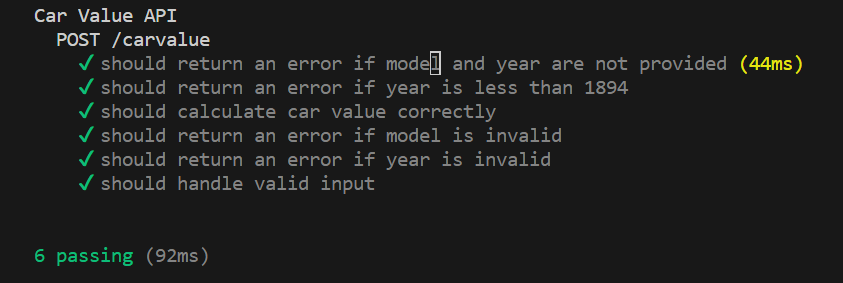

# Car Insurance API

This is a simple Express.js application that provides APIs for calculating car value.

## Technologies Used

- TypeScript
- Node.js
- Express.js
- Mocha (for testing)
- Chai (for assertions in testing)
- Axios (for making HTTP requests)
- Body-parser (for parsing request bodies)

## Setup

To get started, follow these steps:

1. Install Node.js

2. Clone this repository to your local machine:

   ```
   git clone https://github.com/kriraw14/CarInsuranceAPI
   ```

3. Navigate to the project directory:

   ```
   cd CarInsuranceAPI
   ```

4. Install project dependencies:

   ```
   npm install
   ```

5. Start the server:

   ```
   npm start
   ```

By default, the server runs on port 5000, but you can modify the `port` variable in `server.js` to change it.

## API Endpoints

### 1. Calculate Car Value

Endpoint: `POST /carvalue`

Calculates the value of a car based on its model and year.

**Request body** should be a JSON object with the following properties:

- `model`: The model of the car (string)
- `year`: The year the car was made (number)

## Running the Server

You can start the server using the following command:

```
npm start
```

Remember that the server, by default, runs on port 5000. If you want to change the port, you can do so by modifying the `port` variable in `index.ts`.

## Running the Test

You can run the test using the following command:

```
npm test
```
